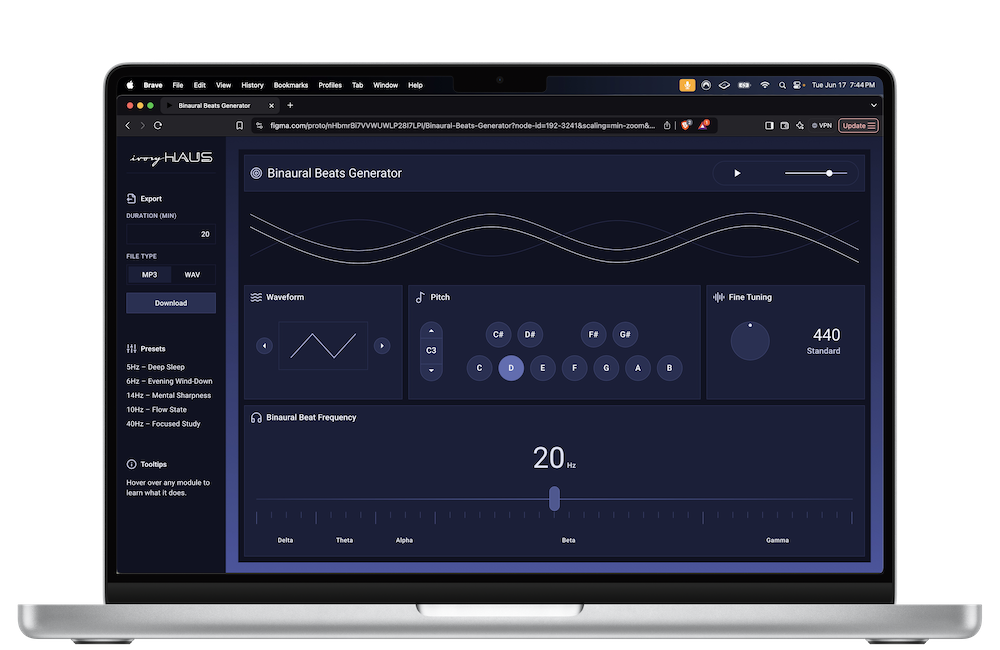
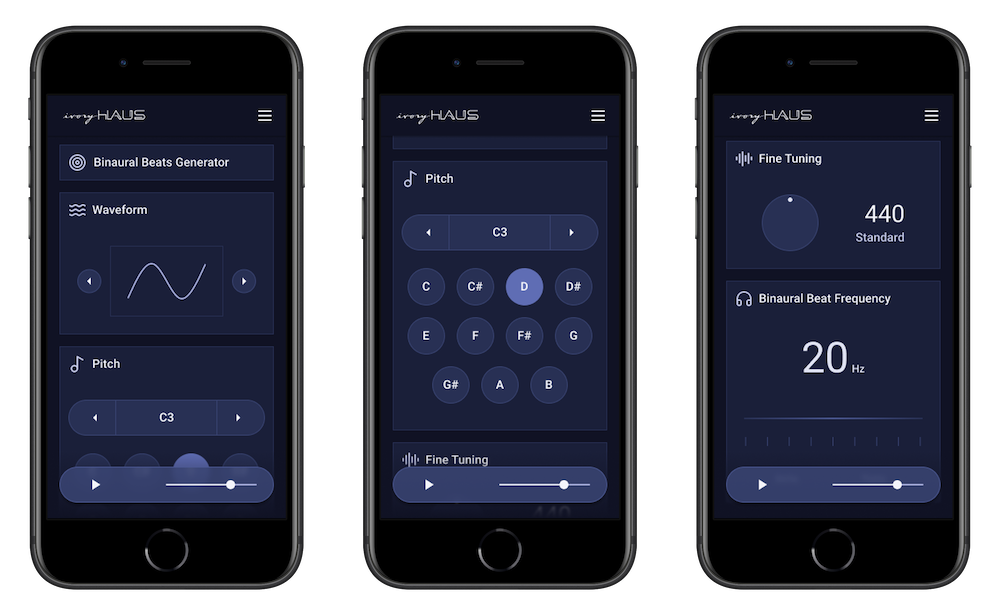
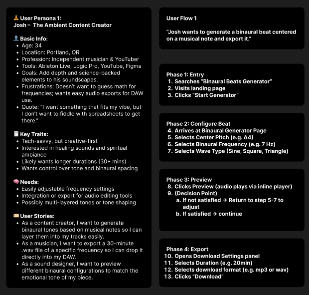
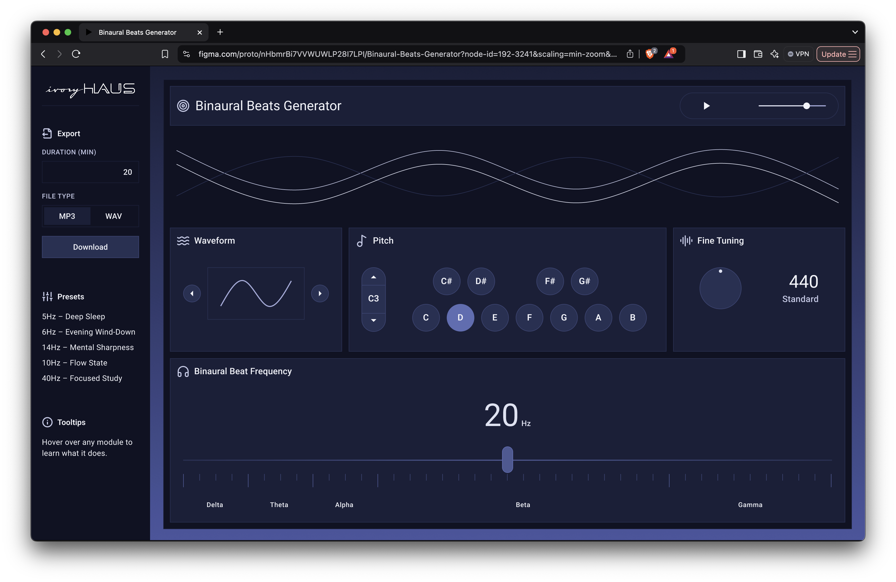

# ivoryHAUS Binaural Beats Generator

A web app for the ambient music project ivoryHAUS.
The app will let users generate binaural beats with adjustable musical pitch, binaural frequency, and tuning.

This project is part of my personal goal to grow as a UI/UX-focused Frontend Developer working with React, TypeScript, and Tailwind CSS.

## Project Purpose

I’m using this project to push myself in:

- UX Design: Starting with user personas and user flows
- UI Design: Focused on minimal, music-inspired interfaces
- Frontend Development: Building clean, component-based UI with React and Tailwind CSS

The goal is to create something that feels thoughtful and useful while improving my design-to-code process.

## The Process So Far

### UX Design

- Created user personas based on likely user groups (Casual Meditators, Students, Sound Designers)
- Mapped out a simple user flow for how people will interact with the app

### UI Design

- Built out a Figma UI design system
- Used Material Design type scales and custom color palettes
- Designed the first round of interface mockups

## Next Steps

- Start implementing the UI in React and Tailwind CSS
- Hook up basic state and props for interactive controls
- Keep iterating on design and layout responsiveness
